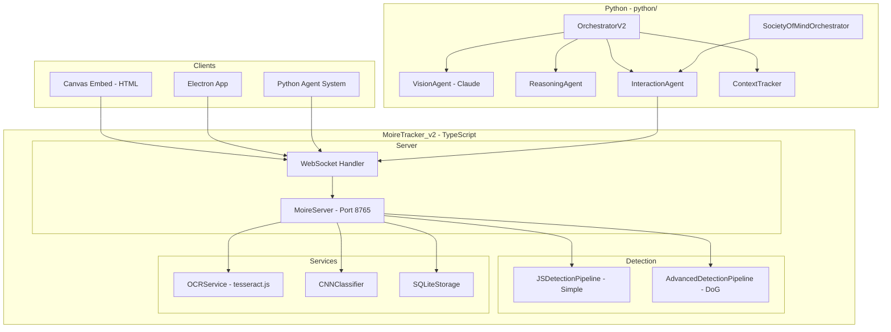

# MoireTracker v2 - Architektur

Cross-platform UI Detection and Analysis System für Electron Embedding.

## Inhaltsverzeichnis

1. [Systemübersicht](#systemübersicht)
2. [Projektstruktur](#projektstruktur)
3. [TypeScript Komponenten](#typescript-komponenten)
4. [Python Agent System](#python-agent-system)
5. [SocietyOfMind Pattern](#societyofmind-pattern)
6. [WebSocket API](#websocket-api)
7. [SQLite Storage](#sqlite-storage)
8. [Konfiguration](#konfiguration)

---

## Systemübersicht

MoireTracker v2 ist ein modulares System zur Erkennung und Analyse von UI-Elementen auf dem Desktop.



---

## Projektstruktur

```
MoireTracker_v2/
├── src/                          # TypeScript Source
│   ├── index.ts                  # Main Exports
│   ├── server/
│   │   └── moire-server.ts       # WebSocket Server
│   ├── detection/
│   │   ├── js-detection.ts       # Sobel + Connected Components
│   │   └── advanced-detection.ts # DoG, Morphology, Confidence
│   ├── services/
│   │   ├── ocr-service.ts        # Tesseract.js OCR
│   │   ├── cnn-service.ts        # CNN Klassifizierung
│   │   └── sqlite-storage.ts     # Icon/Text Findings Storage
│   ├── agents/
│   │   ├── agent-team.ts         # TS Agent Coordinator
│   │   └── types.ts              # Shared Types
│   ├── canvas/                   # UI Canvas Components
│   ├── electron/                 # Electron Integration
│   ├── classifiers/              # ML Classifiers
│   ├── react/                    # React MoireCanvas
│   └── embed/                    # Embeddable HTML
├── python/                       # Python Agent System
│   ├── agents/
│   │   ├── orchestrator_v2.py    # Event-driven Orchestrator
│   │   ├── society_orchestrator.py # AutoGen SocietyOfMind Pattern
│   │   ├── vision_agent.py       # Claude Vision für Element-Finding
│   │   ├── reasoning.py          # Task Planung
│   │   ├── interaction.py        # pyautogui Aktionen
│   │   └── ...
│   ├── bridge/
│   │   └── websocket_client.py   # MoireServer Connection
│   ├── context/
│   │   ├── context_tracker.py    # Cursor/Selection State
│   │   ├── selection_manager.py  # Clipboard Management
│   │   └── word_helper.py        # Word Formatierung
│   ├── core/
│   │   ├── event_queue.py        # Task/Action Queue
│   │   └── openrouter_client.py  # LLM API
│   ├── validation/
│   │   ├── action_validator.py   # Screenshot-based Validation
│   │   └── state_comparator.py   # Screen State Delta
│   ├── main.py                   # Standard Agent Entry
│   ├── main_society.py           # SocietyOfMind Entry
│   └── requirements.txt
├── electron-demo/                # Standalone Electron Demo
├── docker/                       # OCR Docker Setup
├── start_server.bat              # Start TypeScript Server
├── start_agents.bat              # Start Python Agents
└── package.json
```

---

## TypeScript Komponenten

### MoireServer

WebSocket Server auf Port 8765.

```typescript
const server = new MoireServer({
  port: 8765,
  enableOCR: true,
  enableCNN: true,
  useAdvancedDetection: true
});
await server.start();
```

### Detection Pipelines

| Pipeline | Algorithmus | Speed | Accuracy |
|----------|-------------|-------|----------|
| JSDetectionPipeline | Sobel + Connected Components | Fast | Basic |
| AdvancedDetectionPipeline | DoG + Morphology + Confidence | Medium | High |

### SQLite Storage

Persistiert gelernte Icon-Klassifizierungen:

```typescript
import { getStorage, IconFinding } from './services/sqlite-storage';

const storage = getStorage();
await storage.initialize();

// Speichern
await storage.saveIconFinding({
  phash: 'a4b3c2d1...',
  category: 'settings',
  confidence: 0.95,
  source: 'llm'
});

// Ähnliche finden
const similar = await storage.findSimilarIcons(phash, 12);
```

---

## Python Agent System

### OrchestratorV2

Event-driven Agent Koordination mit:
- Task Planning via ReasoningAgent
- Element-Finding via VisionAgent (Claude)
- Action Execution via InteractionAgent
- Screenshot Validation
- Goal Detection

```python
from agents.orchestrator_v2 import get_orchestrator_v2

orchestrator = get_orchestrator_v2()
await orchestrator.start()
result = await orchestrator.execute_task_iterative(
    "Öffne die Einstellungen",
    max_iterations=10
)
```

### VisionAgent

Claude Sonnet 4 für Element-Lokalisierung:

```python
from agents.vision_agent import get_vision_agent

vision = get_vision_agent()
location = await vision.find_element_from_screenshot(
    screenshot_bytes,
    "Settings Button"
)
# => ElementLocation(found=True, x=450, y=300, confidence=0.85)
```

### ContextTracker

Trackt Cursor-Position, Selektion und App-Kontext:

```python
from context import ContextTracker

tracker = ContextTracker()
await tracker.update_after_action(action_type='click', action_params={...})

if tracker.selection.is_active:
    print(f"Selected: {tracker.selection.text}")
```

### SocietyOfMind Pattern

Das SocietyOfMind Pattern nutzt AutoGen AgentChat für hierarchische Agent-Teams mit Qualitätskontrolle.

```python
from agents.society_orchestrator import get_society_orchestrator
        
orchestrator = get_society_orchestrator(
    moire_client=moire_client,
    interaction_agent=interaction_agent,
    model_name="gpt-4o"
)
        
result = await orchestrator.execute_task(
    task="Öffne Word und erstelle ein neues Dokument",
    max_rounds=3
)
        
if result["success"]:
    print("Ziel erreicht!")
else:
    print(f"Fehlgeschlagen: {result.get('error')}")
```

---

## WebSocket API

### Connect

```javascript
const ws = new WebSocket('ws://localhost:8765');
ws.send(JSON.stringify({ type: 'handshake', clientId: 'my-app' }));
```

### Commands (Client → Server)

| Type | Description |
|------|-------------|
| `scan_desktop` | Capture + Detection |
| `run_ocr` | OCR on boxes |
| `run_cnn` | CNN Classification |
| `report_action` | Agent Action Visualization |

### Events (Server → Client)

| Type | Description |
|------|-------------|
| `detection_result` | Boxes, Regions, Screenshot |
| `ocr_update` | Incremental OCR Results |
| `action_visualization` | Agent Click/Type Animation |

---

## SQLite Storage

### Schema

**Icon Findings:**
```json
{
  "id": 1,
  "phash": "a4b3c2d1e5f6...",
  "category": "settings",
  "confidence": 0.95,
  "source": "llm|cnn|manual|heuristic",
  "created_at": "2024-12-09T18:00:00Z"
}
```

**Text Findings:**
```json
{
  "id": 1,
  "text_hash": "abc123...",
  "text": "Settings",
  "category": "button",
  "confidence": 0.9
}
```

### API

```typescript
// Initialize
const storage = await initializeStorage('./data/findings.json');

// Stats
const stats = await storage.getStats();
// => { totalIcons: 150, totalTexts: 80, iconsByCategory: {...} }

// Export/Import
await storage.exportToFile('./backup.json');
await storage.importFromFile('./community-icons.json');
```

---

## Konfiguration

### Environment Variables

```bash
# .env
OPENROUTER_API_KEY=sk-or-...      # Python Agents
OPENAI_API_KEY=sk-...             # Alternative für AutoGen
MOIRE_PORT=8765                    # WebSocket Port
MOIRE_HOST=localhost
```

### Start Commands

```bash
# TypeScript Server
.\start_server.bat

# Python Agents (Standard)
.\start_agents.bat

# Python Agents (SocietyOfMind)
cd python && python main_society.py
```

---

## Lizenz

MIT License