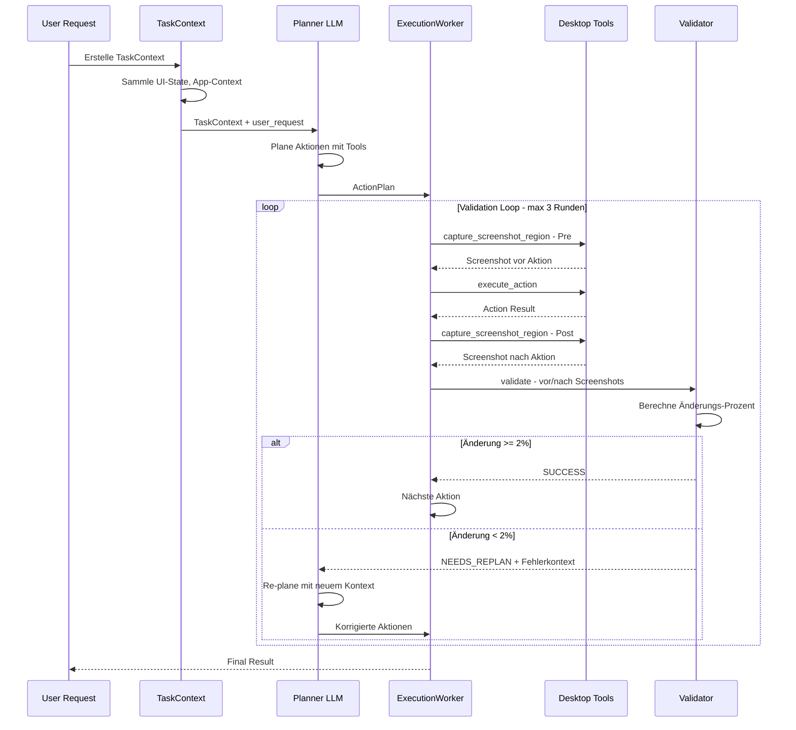

# MoireTracker_v2 - Tool-Using Agents Architektur

## Vollständiger Analyse-Report

**Erstellt:** 2024-12-12  
**Status:** Architektur-Planung abgeschlossen  
**Ziel:** Erweiterte gRPC Worker-Architektur mit Desktop Automation Tools und Validation-Loop

---

## 📋 Inhaltsverzeichnis

1. [Executive Summary](#1-executive-summary)
2. [Bestehende Architektur Analyse](#2-bestehende-architektur-analyse)
3. [Neue Tool-Using Agent Architektur](#3-neue-tool-using-agent-architektur)
4. [Implementierungsplan](#4-implementierungsplan)
5. [Technische Spezifikationen](#5-technische-spezifikationen)
6. [Risiken und Mitigationen](#6-risiken-und-mitigationen)

---

## 1. Executive Summary

### Ziel der Erweiterung

Die bestehende MoireTracker_v2 Worker-Architektur soll erweitert werden, sodass die **LLMs die bereits Klassifikation und Analyse durchführen** zu **vollwertigen Tool-Using Agents** werden:

- **Desktop-Automation-Tools**: `capture_screenshot_region`, `click_at_position`, `type_text`, `scroll`
- **Validation-Loop**: Planner → Execute → Validate → Re-plan bei Fehlschlag
- **TaskContext Propagation**: Voller User-Request-Kontext an alle Worker

### Entscheidungen

| Parameter | Wert | Begründung |
|-----------|------|------------|
| LLM für Tool-Calling | Gemini 2.0 Flash | Bereits etabliert für Classification |
| Screenshot-Region Minimum | 50x50 px | Verhindert zu kleine Validation-Bereiche |
| Änderungs-Threshold | 2% | Bestehendes ActionValidator Setting |
| Max Validation-Rounds | 3 | Wie Orchestrator V2 Reflection-Loop |

---

## 2. Bestehende Architektur Analyse

### 2.1 Worker Bridge Struktur

```
MoireTracker_v2/python/worker_bridge/
├── __init__.py
├── __main__.py
├── host.py              # gRPC Host Management
├── http_bridge.py       # REST API auf Port 8766
├── messages.py          # Message Types (403 Zeilen)
└── workers/
    ├── __init__.py
    ├── classification_worker.py  # LLM Icon Classification (582 Zeilen)
    └── validation_worker.py      # CNN/LLM Validation (467 Zeilen)
```

### 2.2 Bestehende Message Types

**In `messages.py` definiert:**

| Message Type | Zweck | Zeilen |
|--------------|-------|--------|
| `ClassifyIconMessage` | Anfrage zur Icon-Klassifizierung | 51-86 |
| `ClassificationResult` | Ergebnis mit LLM-Kategorie | 89-140 |
| `ValidationRequest` | CNN/LLM Vergleichs-Anfrage | 143-182 |
| `ValidationResult` | Finale Kategorie + Confidence | 185-230 |
| `BatchClassifyRequest` | Mehrere Icons auf einmal | 233-250 |
| `WorkerStatus` | Worker-Zustandsinformationen | 326-348 |
| `CategorySuggestion` | Neue Kategorie-Vorschläge | 284-302 |

**Bestehende Helper Functions:**
- `calculate_combined_confidence()` - Kombiniert CNN + LLM Konfidenz
- `should_trigger_active_learning()` - Entscheidet Active Learning

### 2.3 HTTP Bridge Endpoints

**Aktuell verfügbar auf Port 8766:**

| Endpoint | Methode | Funktion |
|----------|---------|----------|
| `/status` | GET | Host-Status mit Worker-Info |
| `/classify_batch` | POST | Batch Icon-Klassifizierung |
| `/classify_single` | POST | Einzelne Icon-Klassifizierung |
| `/start` | POST | gRPC Host starten |
| `/stop` | POST | gRPC Host stoppen |
| `/active_learning/queue` | GET | Active Learning Queue anzeigen |
| `/active_learning/confirm` | POST | Label bestätigen |
| `/stats` | GET | Detaillierte Statistiken |

### 2.4 Classification Worker

**Datei:** `classification_worker.py` (582 Zeilen)

**Kernfunktionalität:**
```python
class ClassificationWorker:
    async def classify(self, message: ClassifyIconMessage) -> ClassificationResult:
        # 1. Build user message with image
        # 2. Get dynamic system prompt from CategoryRegistry
        # 3. Call LLM (Gemini 2.0 Flash)
        # 4. Parse JSON response
        # 5. Handle NEW_CATEGORY suggestions
        # 6. Return ClassificationResult
```

**Wichtige Features:**
- **Dynamic Categories**: Nutzt `CategoryRegistry` für dynamische Kategorien
- **NEW_CATEGORY Handling**: Auto-Approve nach 3 LLM-Vorschlägen
- **Batch Processing**: `classify_batch()` mit asyncio.gather
- **Rate Limiting**: Semaphore (max_concurrent=5)
- **Prompt Caching**: 5 Minuten Cache für System-Prompt

### 2.5 Validation Worker

**Datei:** `validation_worker.py` (467 Zeilen)

**Kernfunktionalität:**
```python
class VisionValidationWorker:
    async def validate(self, request: ValidationRequest) -> ValidationResult:
        # 1. Compare CNN and LLM categories
        # 2. Calculate combined confidence
        # 3. Decide final category (weighted)
        # 4. Check if active learning needed
        # 5. Return ValidationResult
```

**Entscheidungslogik:**
- **Match**: Beide übereinstimmend → Confidence Boost (×1.2)
- **Mismatch, LLM confident**: LLM überschreibt (70% Gewicht)
- **Mismatch, CNN confident**: CNN überschreibt (30% Gewicht)
- **Beide unsicher**: Active Learning Trigger

### 2.6 Orchestrator V2

**Datei:** `orchestrator_v2.py` (1067 Zeilen)

**Wichtige Komponenten:**

1. **Reflection-Loop** (Zeilen 582-761):
   ```python
   async def execute_task_with_reflection(
       self, goal: str, 
       max_reflection_rounds: int = 3,
       actions_per_round: int = 3
   ) -> Dict[str, Any]
   ```
   - Max 3 Reflection-Runden
   - Vision-basierte Goal-Detection
   - Re-Planning bei Fehlschlag

2. **Vision Goal Check** (Zeilen 358-409):
   ```python
   async def _vision_goal_check(self, goal: str, screenshot: bytes) -> Dict[str, Any]
   ```
   - Nutzt VisionAgent für Goal-Analyse
   - Gibt achieved, confidence, reason zurück

3. **State Management:**
   - `_current_screen_state`: Aktueller UI-State
   - `_last_screenshot`: Letzter Screenshot
   - `ContextTracker`: Selektion/Cursor-Tracking

### 2.7 InteractionAgent

**Datei:** `agents/interaction.py` (1096 Zeilen)

**Verfügbare Aktionen:**

| Methode | Beschreibung |
|---------|--------------|
| `click(target, button, clicks)` | Klick auf Koordinaten |
| `double_click(target)` | Doppelklick |
| `right_click(target)` | Rechtsklick |
| `move_to(target)` | Maus bewegen |
| `drag(start, end, button)` | Drag & Drop |
| `type_text(text, use_clipboard)` | Text eingeben |
| `press_key(key, presses)` | Taste drücken |
| `hotkey(*keys)` | Tastenkombination |
| `scroll(direction, amount)` | Scrollen |
| `wait(seconds)` | Warten |
| `select_text_by_coords(start, end)` | Text markieren |
| `triple_click_select(target)` | Zeile markieren |

**Features:**
- Unicode-Support via Clipboard
- Action History (letzte 100 Aktionen)
- MoireServer Action Reporting
- PyAutoGUI-basiert mit FAILSAFE=True

### 2.8 ActionValidator

**Datei:** `validation/action_validator.py` (400 Zeilen)

**Validation-Ablauf:**
1. Screenshot vor Aktion speichern
2. Aktion ausführen
3. Loop bis Timeout: Screenshots vergleichen
4. Bei Änderung ≥2%: Erfolg
5. Bei Timeout: Fehlschlag

**Wichtige Parameter:**
- `default_timeout`: 5.0 Sekunden
- `check_interval`: 0.3 Sekunden
- `use_llm_validation`: True (optional)

---

## 3. Neue Tool-Using Agent Architektur

### 3.1 Architektur-Übersicht

```
┌─────────────────────────────────────────────────────────────────────┐
│                        User Request                                  │
│   "Öffne Chrome und navigiere zu google.com"                        │
└────────────────────────────┬────────────────────────────────────────┘
                             │
                             ▼
┌─────────────────────────────────────────────────────────────────────┐
│                     TaskContext Propagation                          │
│   user_request: "Öffne Chrome..."                                    │
│   app_context: {active_window: "Desktop", resolution: [1920,1080]}  │
│   ui_state: {detected_elements: [...], focus_element: null}          │
└────────────────────────────┬────────────────────────────────────────┘
                             │
                             ▼
┌─────────────────────────────────────────────────────────────────────┐
│                        Planner (LLM)                                 │
│   Input: TaskContext                                                 │
│   Output: ActionPlan [                                               │
│     {tool: "capture_screenshot_region", params: {x:0, y:0, w:1920}},│
│     {tool: "click_at_position", params: {x:50, y:750}},             │
│     {tool: "wait", params: {seconds: 1}},                           │
│     ...                                                              │
│   ]                                                                  │
└────────────────────────────┬────────────────────────────────────────┘
                             │
              ┌──────────────┴──────────────┐
              │                             │
              ▼                             │
┌─────────────────────────┐                 │
│   ExecutionWorker       │                 │
│   ┌───────────────────┐ │                 │
│   │ Tool Execution    │ │                 │
│   │ - capture_region  │ │                 │
│   │ - click_position  │ │                 │
│   │ - type_text       │ │                 │
│   │ - scroll          │ │                 │
│   └─────────┬─────────┘ │                 │
│             │           │                 │
│             ▼           │                 │
│   ┌───────────────────┐ │                 │
│   │ Post-Validation   │ │                 │
│   │ Screenshot +      │ │                 │
│   │ State Compare     │ │                 │
│   └─────────┬─────────┘ │                 │
└─────────────┼───────────┘                 │
              │                             │
              ▼                             │
┌─────────────────────────┐                 │
│   Validation Result     │                 │
│   success: true/false   │                 │
│   change_detected: 2.5% │                 │
│   screenshot_after: ... │                 │
└─────────────┬───────────┘                 │
              │                             │
              ▼                             │
         ┌────────┐                         │
         │Success?│─── No ──────────────────┘
         └────┬───┘        Re-plan mit
              │            Fehlerkontext
              │ Yes
              ▼
┌─────────────────────────┐
│   Final Result          │
│   goal_achieved: true   │
│   total_actions: 5      │
│   validation_rounds: 2  │
└─────────────────────────┘
```

### 3.2 Validation-Loop Sequenzdiagramm



### 3.3 Neue Message Types

```python
# Neue Enums
class ToolName(str, Enum):
    CAPTURE_SCREENSHOT_REGION = "capture_screenshot_region"
    CLICK_AT_POSITION = "click_at_position"
    TYPE_TEXT = "type_text"
    SCROLL = "scroll"
    WAIT = "wait"
    WAIT_FOR_ELEMENT = "wait_for_element"

class ExecutionStatus(str, Enum):
    PENDING = "pending"
    EXECUTING = "executing"
    VALIDATING = "validating"
    SUCCESS = "success"
    FAILED = "failed"
    NEEDS_REPLAN = "needs_replan"

# Neue Dataclasses
@dataclass
class TaskContext:
    """Vollständiger Kontext für Tool-Using Agents."""
    user_request: str                    # Original User-Anfrage
    app_context: Dict[str, Any]          # Active Window, Resolution
    ui_state: Dict[str, Any]             # Detected Elements, Focus
    history: List[Dict[str, Any]]        # Bisherige Aktionen
    metadata: Dict[str, Any] = field(default_factory=dict)

@dataclass
class ActionStep:
    """Einzelne Aktion mit Tool-Call."""
    step_id: str
    tool_name: ToolName
    tool_params: Dict[str, Any]
    expected_outcome: str
    timeout_seconds: float = 5.0

@dataclass
class TaskExecutionRequest:
    """Anfrage zur Task-Ausführung."""
    task_id: str
    context: TaskContext
    action_plan: List[ActionStep]
    max_validation_rounds: int = 3

@dataclass
class ToolExecutionResult:
    """Ergebnis einer Tool-Ausführung."""
    step_id: str
    tool_name: ToolName
    status: ExecutionStatus
    screenshot_before: Optional[str] = None  # Base64
    screenshot_after: Optional[str] = None   # Base64
    change_percentage: float = 0.0
    action_result: Dict[str, Any] = field(default_factory=dict)
    error_context: Optional[str] = None
    duration_ms: float = 0.0

@dataclass
class TaskExecutionResult:
    """Endergebnis einer Task-Ausführung."""
    task_id: str
    success: bool
    status: ExecutionStatus
    steps_executed: int
    steps_total: int
    validation_rounds: int
    results: List[ToolExecutionResult]
    final_screenshot: Optional[str] = None
    error_summary: Optional[str] = None
    total_duration_ms: float = 0.0
```

### 3.4 Desktop Tool Definitions

```python
DESKTOP_TOOLS = {
    "capture_screenshot_region": {
        "description": "Captures a screenshot of a specific region for context and validation",
        "parameters": {
            "x": {"type": "int", "description": "X coordinate of region"},
            "y": {"type": "int", "description": "Y coordinate of region"},
            "width": {"type": "int", "description": "Width of region", "min": 50},
            "height": {"type": "int", "description": "Height of region", "min": 50}
        },
        "returns": "Base64-encoded PNG image"
    },
    
    "click_at_position": {
        "description": "Clicks at specified screen coordinates",
        "parameters": {
            "x": {"type": "int", "description": "X coordinate"},
            "y": {"type": "int", "description": "Y coordinate"},
            "button": {"type": "str", "enum": ["left", "right", "middle"], "default": "left"},
            "clicks": {"type": "int", "default": 1, "max": 3}
        },
        "returns": "Action result with success status"
    },
    
    "type_text": {
        "description": "Types text at current cursor position",
        "parameters": {
            "text": {"type": "str", "description": "Text to type"},
            "use_clipboard": {"type": "bool", "default": True, "description": "Use clipboard for Unicode support"}
        },
        "returns": "Action result with characters typed"
    },
    
    "scroll": {
        "description": "Scrolls in specified direction",
        "parameters": {
            "direction": {"type": "str", "enum": ["up", "down", "left", "right"]},
            "amount": {"type": "int", "default": 3, "description": "Scroll amount in lines"},
            "x": {"type": "int", "optional": True, "description": "X position for scroll"},
            "y": {"type": "int", "optional": True, "description": "Y position for scroll"}
        },
        "returns": "Action result"
    },
    
    "wait": {
        "description": "Waits for specified duration",
        "parameters": {
            "seconds": {"type": "float", "default": 1.0, "max": 10.0}
        },
        "returns": "Wait completed"
    },
    
    "wait_for_element": {
        "description": "Waits until UI element with specified text appears",
        "parameters": {
            "element_text": {"type": "str", "description": "Text to find in UI"},
            "timeout_seconds": {"type": "float", "default": 5.0, "max": 30.0}
        },
        "returns": "Element found or timeout"
    }
}
```

---

## 4. Implementierungsplan

### 4.1 Phase 1: Message Types (Priorität: HOCH)

**Datei:** `MoireTracker_v2/python/worker_bridge/messages.py`

**Änderungen:**
1. Neue Enums hinzufügen: `ToolName`, `ExecutionStatus`
2. Neue Dataclasses: `TaskContext`, `ActionStep`, `TaskExecutionRequest`, `ToolExecutionResult`, `TaskExecutionResult`
3. Serialisierungs-Methoden: `to_dict()`, `from_dict()`

**Geschätzter Aufwand:** 1-2 Stunden

### 4.2 Phase 2: Desktop Tools (Priorität: HOCH)

**Neue Datei:** `MoireTracker_v2/python/worker_bridge/workers/desktop_tools.py`

**Inhalt:**
1. `DESKTOP_TOOLS` Dictionary mit Tool-Definitionen
2. `DesktopToolExecutor` Klasse
   - `execute_tool(tool_name, params)` → Delegiert an InteractionAgent
   - `capture_region(x, y, width, height)` → Screenshot mit PIL
   - `get_tool_schema()` → OpenAI Function-Calling Format

**Geschätzter Aufwand:** 2-3 Stunden

### 4.3 Phase 3: ExecutionWorker (Priorität: HOCH)

**Neue Datei:** `MoireTracker_v2/python/worker_bridge/workers/execution_worker.py`

**Kernlogik:**
```python
class ExecutionWorker:
    async def execute_task(self, request: TaskExecutionRequest) -> TaskExecutionResult:
        results = []
        validation_rounds = 0
        
        for step in request.action_plan:
            # Pre-Screenshot
            screenshot_before = await self.tools.capture_region(...)
            
            # Tool ausführen
            result = await self.tools.execute_tool(step.tool_name, step.tool_params)
            
            # Post-Screenshot
            screenshot_after = await self.tools.capture_region(...)
            
            # Validieren
            validation = await self._validate_step(screenshot_before, screenshot_after, step)
            
            if validation.status == ExecutionStatus.NEEDS_REPLAN:
                validation_rounds += 1
                if validation_rounds >= request.max_validation_rounds:
                    return TaskExecutionResult(success=False, ...)
                
                # Re-plan triggern
                new_plan = await self._request_replan(request.context, results, validation)
                # Weiter mit neuem Plan...
            
            results.append(ToolExecutionResult(...))
        
        return TaskExecutionResult(success=True, results=results, ...)
```

**Geschätzter Aufwand:** 4-6 Stunden

### 4.4 Phase 4: HTTP Bridge Erweiterung (Priorität: MITTEL)

**Datei:** `MoireTracker_v2/python/worker_bridge/http_bridge.py`

**Neue Endpoints:**

| Endpoint | Methode | Funktion |
|----------|---------|----------|
| `/execute_task` | POST | Startet Task mit vollem Kontext |
| `/execute_action` | POST | Einzelne Tool-Aktion |
| `/validate_action` | POST | Screenshot-basierte Validation |
| `/task/{task_id}/status` | GET | Task-Status mit Validation-Rounds |
| `/task/{task_id}/cancel` | POST | Task abbrechen |

**Geschätzter Aufwand:** 2-3 Stunden

### 4.5 Phase 5: Orchestrator Integration (Priorität: MITTEL)

**Datei:** `MoireTracker_v2/python/agents/orchestrator_v2.py`

**Änderungen:**
1. `execute_task_with_tools()` - Neue Methode die ExecutionWorker nutzt
2. Integration in `execute_task_with_reflection()` Reflection-Loop
3. TaskContext-Builder aus aktuellem State

**Geschätzter Aufwand:** 3-4 Stunden

### 4.6 Phase 6: Tests & Dokumentation (Priorität: NIEDRIG)

**Neue Dateien:**
- `MoireTracker_v2/python/tests/test_execution_worker.py`
- `MoireTracker_v2/python/tests/test_desktop_tools.py`
- Update: `MoireTracker_v2/README.md`

**Geschätzter Aufwand:** 2-3 Stunden

---

## 5. Technische Spezifikationen

### 5.1 Screenshot-Region Capture

```python
async def capture_region(x: int, y: int, width: int, height: int) -> str:
    """
    Captures a screenshot region.
    
    Constraints:
    - Minimum size: 50x50 px
    - Maximum size: Full screen
    - Returns: Base64-encoded PNG
    """
    # Validate bounds
    width = max(50, min(width, screen_width - x))
    height = max(50, min(height, screen_height - y))
    
    # Capture with PIL
    screenshot = ImageGrab.grab(bbox=(x, y, x + width, y + height))
    
    # Encode to base64
    buffer = io.BytesIO()
    screenshot.save(buffer, format="PNG")
    return base64.b64encode(buffer.getvalue()).decode()
```

### 5.2 Validation-Algorithmus

```python
async def validate_action(
    screenshot_before: str,
    screenshot_after: str,
    expected_change: str,
    threshold: float = 0.02  # 2%
) -> ValidationResult:
    """
    Compares before/after screenshots.
    
    Returns:
    - SUCCESS: change >= threshold
    - FAILED: change < threshold after timeout
    - NEEDS_REPLAN: repeated failures
    """
    # Decode screenshots
    img_before = Image.open(io.BytesIO(base64.b64decode(screenshot_before)))
    img_after = Image.open(io.BytesIO(base64.b64decode(screenshot_after)))
    
    # Calculate pixel difference
    diff = ImageChops.difference(img_before, img_after)
    changed_pixels = sum(1 for p in diff.getdata() if sum(p) > 10)
    total_pixels = img_before.width * img_before.height
    change_percentage = changed_pixels / total_pixels
    
    if change_percentage >= threshold:
        return ValidationResult(status="SUCCESS", change=change_percentage)
    else:
        return ValidationResult(status="FAILED", change=change_percentage)
```

### 5.3 LLM Function-Calling Schema

```python
TOOL_FUNCTIONS = [
    {
        "name": "capture_screenshot_region",
        "description": "Capture a screenshot of a specific region for context",
        "parameters": {
            "type": "object",
            "properties": {
                "x": {"type": "integer", "description": "X coordinate"},
                "y": {"type": "integer", "description": "Y coordinate"},
                "width": {"type": "integer", "description": "Width (min 50)"},
                "height": {"type": "integer", "description": "Height (min 50)"}
            },
            "required": ["x", "y", "width", "height"]
        }
    },
    {
        "name": "click_at_position",
        "description": "Click at screen coordinates",
        "parameters": {
            "type": "object",
            "properties": {
                "x": {"type": "integer"},
                "y": {"type": "integer"},
                "button": {"type": "string", "enum": ["left", "right", "middle"]},
                "clicks": {"type": "integer", "default": 1}
            },
            "required": ["x", "y"]
        }
    },
    # ... weitere Tools
]
```

### 5.4 LLM Size Parameter Validation & Reporting

Der LLM soll seine angeforderten Size-Parameter mit den erkannten UI-Element-Werten abgleichen und die entsprechende px-Größe an den Function Agent reporten.

#### Workflow

```
┌─────────────────────────────────────────────────────────────────────┐
│                    LLM Size Validation Flow                          │
└─────────────────────────────────────────────────────────────────────┘

1. LLM erhält UI-State mit Element-Bounds
   {
     "elements": [
       {"id": "btn_1", "text": "OK", "bounds": {"x": 100, "y": 200, "w": 80, "h": 30}},
       {"id": "input_1", "text": "", "bounds": {"x": 50, "y": 150, "w": 300, "h": 25}}
     ]
   }

2. LLM plant Tool-Call mit Size-Request
   {
     "tool": "capture_screenshot_region",
     "target_element": "btn_1",
     "requested_size": {"width": 100, "height": 50},
     "reasoning": "Capture OK button with margin for validation"
   }

3. Size Validator vergleicht LLM-Request mit Element-Bounds
   - Element bounds: 80x30 px
   - LLM requested: 100x50 px
   - Delta: +20px width, +20px height (Margin ok)
   - Minimum check: >= 50x50 ✓

4. Report an Function Agent
   {
     "validation_result": "APPROVED",
     "original_request": {"width": 100, "height": 50},
     "element_bounds": {"width": 80, "height": 30},
     "applied_size": {"width": 100, "height": 50},
     "adjustments": {
       "width_delta": 20,
       "height_delta": 20,
       "reason": "LLM added margin around element"
     }
   }
```

#### Size Validation Rules

```python
class SizeValidator:
    """Validiert LLM Size-Requests gegen UI-Element-Bounds."""
    
    MIN_SIZE = 50  # Minimum 50x50 px
    MAX_MARGIN = 100  # Max 100px extra margin
    
    def validate_size_request(
        self,
        llm_request: Dict[str, int],
        element_bounds: Dict[str, int],
        screen_bounds: Dict[str, int]
    ) -> Dict[str, Any]:
        """
        Validiert Size-Request und reportet an Function Agent.
        
        Args:
            llm_request: {"width": int, "height": int, "x": int, "y": int}
            element_bounds: {"x": int, "y": int, "width": int, "height": int}
            screen_bounds: {"width": int, "height": int}
            
        Returns:
            Validation result mit applied_size und adjustments
        """
        # 1. Minimum Size Check
        requested_w = max(self.MIN_SIZE, llm_request.get("width", self.MIN_SIZE))
        requested_h = max(self.MIN_SIZE, llm_request.get("height", self.MIN_SIZE))
        
        # 2. Element Bounds Comparison
        elem_w = element_bounds.get("width", 0)
        elem_h = element_bounds.get("height", 0)
        
        width_delta = requested_w - elem_w
        height_delta = requested_h - elem_h
        
        # 3. Margin Validation (LLM kann Margin hinzufügen)
        adjustments = {"reason": []}
        
        if width_delta < 0:
            # LLM requested smaller than element - expand to element size
            requested_w = max(elem_w, self.MIN_SIZE)
            adjustments["reason"].append("Expanded width to element size")
        elif width_delta > self.MAX_MARGIN:
            # LLM requested too much margin - cap it
            requested_w = elem_w + self.MAX_MARGIN
            adjustments["reason"].append(f"Capped width margin to {self.MAX_MARGIN}px")
            
        if height_delta < 0:
            requested_h = max(elem_h, self.MIN_SIZE)
            adjustments["reason"].append("Expanded height to element size")
        elif height_delta > self.MAX_MARGIN:
            requested_h = elem_h + self.MAX_MARGIN
            adjustments["reason"].append(f"Capped height margin to {self.MAX_MARGIN}px")
        
        # 4. Screen Bounds Clipping
        x = llm_request.get("x", element_bounds.get("x", 0))
        y = llm_request.get("y", element_bounds.get("y", 0))
        
        if x + requested_w > screen_bounds["width"]:
            requested_w = screen_bounds["width"] - x
            adjustments["reason"].append("Clipped to screen width")
            
        if y + requested_h > screen_bounds["height"]:
            requested_h = screen_bounds["height"] - y
            adjustments["reason"].append("Clipped to screen height")
        
        # 5. Build Report für Function Agent
        return {
            "validation_result": "APPROVED" if not adjustments["reason"] else "ADJUSTED",
            "original_request": llm_request,
            "element_bounds": element_bounds,
            "applied_size": {
                "x": x,
                "y": y,
                "width": requested_w,
                "height": requested_h
            },
            "adjustments": {
                "width_delta": requested_w - elem_w,
                "height_delta": requested_h - elem_h,
                "reasons": adjustments["reason"]
            }
        }
```

#### Function Agent Integration

```python
class FunctionAgent:
    """Agent der Tool-Calls mit Size-Validation ausführt."""
    
    def __init__(self):
        self.size_validator = SizeValidator()
        self.execution_history = []
    
    async def execute_with_size_validation(
        self,
        tool_call: Dict[str, Any],
        ui_state: Dict[str, Any]
    ) -> Dict[str, Any]:
        """
        Führt Tool-Call aus mit Size-Validation und Reporting.
        """
        tool_name = tool_call["name"]
        params = tool_call["parameters"]
        
        # Nur für capture_screenshot_region relevant
        if tool_name == "capture_screenshot_region":
            # Finde target element wenn angegeben
            target_element = None
            if "target_element" in params:
                target_element = self._find_element(
                    params["target_element"], 
                    ui_state.get("elements", [])
                )
            
            # Size Validation
            validation_result = self.size_validator.validate_size_request(
                llm_request={
                    "x": params.get("x", 0),
                    "y": params.get("y", 0),
                    "width": params.get("width", 50),
                    "height": params.get("height", 50)
                },
                element_bounds=target_element.get("bounds", {}) if target_element else {},
                screen_bounds=ui_state.get("screen_bounds", {"width": 1920, "height": 1080})
            )
            
            # Report Validation Result
            self._report_size_validation(tool_call, validation_result)
            
            # Execute mit adjusted size
            applied = validation_result["applied_size"]
            return await self._capture_region(
                applied["x"], 
                applied["y"], 
                applied["width"], 
                applied["height"]
            )
        
        # Andere Tools normal ausführen
        return await self._execute_tool(tool_name, params)
    
    def _report_size_validation(
        self,
        tool_call: Dict[str, Any],
        validation_result: Dict[str, Any]
    ):
        """Reportet Size-Validation an Logging/Metrics."""
        report = {
            "timestamp": datetime.now().isoformat(),
            "tool_call": tool_call,
            "validation": validation_result,
            "llm_model": "gemini-2.0-flash",
        }
        
        self.execution_history.append(report)
        
        # Log für Analyse
        logger.info(f"Size Validation Report: {report['validation']['validation_result']}")
        logger.info(f"  Original: {report['validation']['original_request']}")
        logger.info(f"  Applied: {report['validation']['applied_size']}")
        
        if report['validation']['adjustments']['reasons']:
            logger.info(f"  Adjustments: {report['validation']['adjustments']['reasons']}")

#### Beispiel-Flow

```
User Request: "Klicke auf den OK Button"

1. LLM analysiert UI-State:
   - OK Button gefunden bei x=100, y=200, w=80, h=30
   
2. LLM generiert Tool-Call:
   {
     "tool": "capture_screenshot_region",
     "parameters": {
       "x": 90,           // 10px links vom Button
       "y": 190,          // 10px über dem Button  
       "width": 100,      // 80 + 20px margin
       "height": 50,      // 30 + 20px margin
       "target_element": "btn_OK"
     },
     "reasoning": "Capture OK button with 10px margin for context"
   }

3. Size Validator prüft:
   - LLM requested 100x50 für Element 80x30 ✓
   - Margin von 20px ist unter MAX_MARGIN (100px) ✓
   - Minimum 50x50 erfüllt ✓
   - Innerhalb Screen Bounds ✓

4. Report an Function Agent:
   {
     "validation_result": "APPROVED",
     "original_request": {"x": 90, "y": 190, "width": 100, "height": 50},
     "element_bounds": {"x": 100, "y": 200, "width": 80, "height": 30},
     "applied_size": {"x": 90, "y": 190, "width": 100, "height": 50},
     "adjustments": {
       "width_delta": 20,
       "height_delta": 20,
       "reasons": []  // Keine Anpassungen nötig
     }
   }

5. Screenshot wird mit 100x50 px erfasst
```

---

## 6. Risiken und Mitigationen

### 6.1 Performance

| Risiko | Wahrscheinlichkeit | Impact | Mitigation |
|--------|-------------------|--------|------------|
| Screenshot-Capture zu langsam | Mittel | Mittel | Async capture, Region statt Fullscreen |
| LLM-Latenz bei Re-Planning | Hoch | Mittel | Timeout limits, Cached prompts |
| Memory-Overflow bei vielen Screenshots | Niedrig | Hoch | Base64 streaming, Cleanup nach Validation |

### 6.2 Funktional

| Risiko | Wahrscheinlichkeit | Impact | Mitigation |
|--------|-------------------|--------|------------|
| Falsche Koordinaten vom LLM | Mittel | Niedrig | Bounds checking, Element-Snapping |
| Validation-Loop Endlosschleife | Niedrig | Hoch | Max 3 Rounds hardlimit |
| Tool-Execution fehlschlägt | Mittel | Mittel | Retry-Logik, Graceful degradation |

### 6.3 Integration

| Risiko | Wahrscheinlichkeit | Impact | Mitigation |
|--------|-------------------|--------|------------|
| Breaking Changes in Messages | Mittel | Hoch | Backwards-compatible with optional fields |
| HTTP Bridge Überlastung | Niedrig | Mittel | Request queuing, Rate limiting |
| Orchestrator V2 Konflikte | Niedrig | Mittel | Feature flag für neue Tools |

---

## 7. Nächste Schritte

Die Implementierung erfolgt in dieser Reihenfolge:

1. **[JETZT]** Message Types in `messages.py` erweitern
2. Desktop Tools in `workers/desktop_tools.py` erstellen
3. ExecutionWorker in `workers/execution_worker.py` implementieren
4. HTTP Bridge Endpoints erweitern
5. Orchestrator V2 Integration
6. Tests und Dokumentation

**Wechsel zu Code-Modus für Implementierung empfohlen.**

---

*Report erstellt am 2024-12-12 von Kilo Code Architect Mode*
